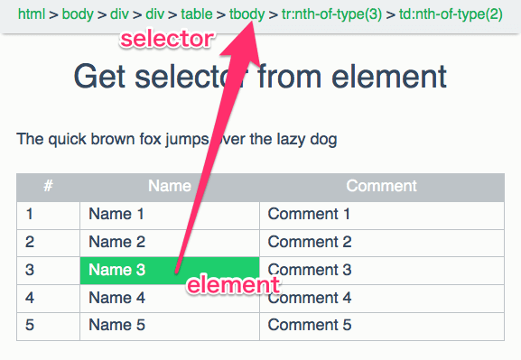

# Get selector from element

Sample of JavaScript to get a selector for the element.

## Screenshot



## Code

* referenced: [javascript - Get CSS path from Dom element - Stack Overflow](http://stackoverflow.com/questions/3620116/get-css-path-from-dom-element "javascript - Get CSS path from Dom element - Stack Overflow")


```js
function getSiblingElemetsIndex( el, name ) {
  var index = 1;
  var sib   = el;

  while( ( sib = sib.previousElementSibling ) ) {
    if( sib.nodeName.toLowerCase() === name ) {
      ++index;
    }
  }

  return index;
}

function getSelectorFromElement( el ) {
  var names = [];
  if( !( el instanceof Element ) ) { return names; }

  while( el.nodeType === Node.ELEMENT_NODE ) {
    var name = el.nodeName.toLowerCase();
    if( el.id ) {
      name += '#' + el.id;
      names.unshift( name );
      break;
    }

    var index = getSiblingElemetsIndex( el, name );
    if( 1 < index ) {
      name += ':nth-of-type(' + index + ')';
    }

    names.unshift( name );
    el = el.parentNode;
  }

  return names;
}
```

## License

MIT