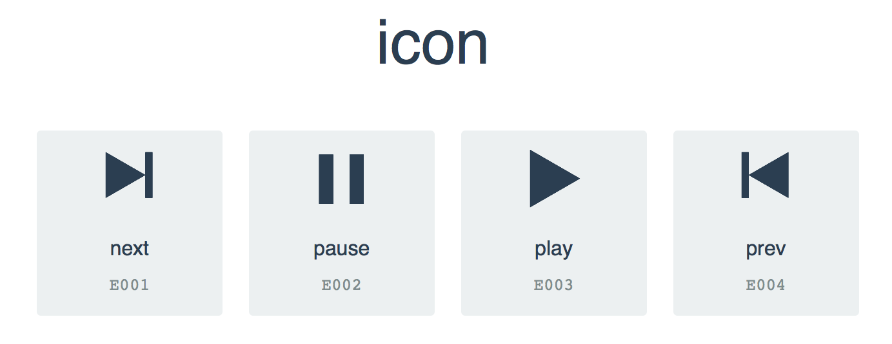

# Example: gulp-iconfont

Example for [gulp-iconfont](https://www.npmjs.com/package/gulp-iconfont "gulp-iconfont").

# Installation

1. Install node.js and gulp ( global )
1. git clone https://github.com/akabekobeko/examples-web-app.git
1. cd gulp-iconfont
1. npm install
1. gulp font
